# IITJ-Stream Analytics Assignment I
IITJ Stream Analytics Assignment I

[![Contributors][contributors-shield]][contributors-url]  
[![Forks][forks-shield]][forks-url]  
[![Stargazers][stars-shield]][stars-url]  
![Issues][issues-shield]

---

## Overview

The goal of this assignment is to analyze and classify TCP traffic data using the SiLK suite. The tasks include:

1. **Retrieve the Data Stream:** Filter data to only include TCP traffic flowing through the network using the SiLK suite.
2. **Classify Nodes:** Group nodes based on TCP traffic handled within specific ranges (e.g., 10-100 packets/second). Implement and compare two algorithms: 
   - Very Fast Decision Trees (VFDT)
   - On-Demand Classification
   During the demonstration, queries should retrieve data from at least two different ranges to evaluate classification accuracy.
3. **Anomaly Detection:** Identify nodes sending an unusually high number of TCP packets per second (e.g., ≥ 1000 packets/second). The threshold can be adjusted based on observations.

---

## Requirements
[Requirements](assets/pdf/stream1.pdf)

### Images / Graphs / Connection Screenshots

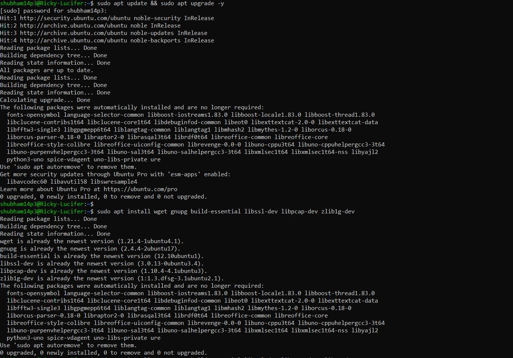
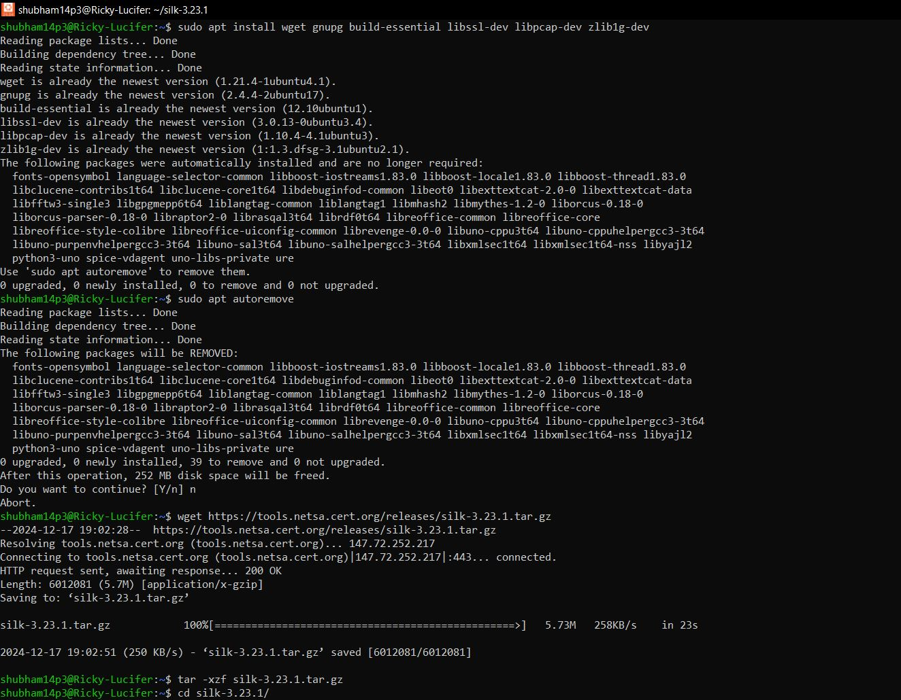
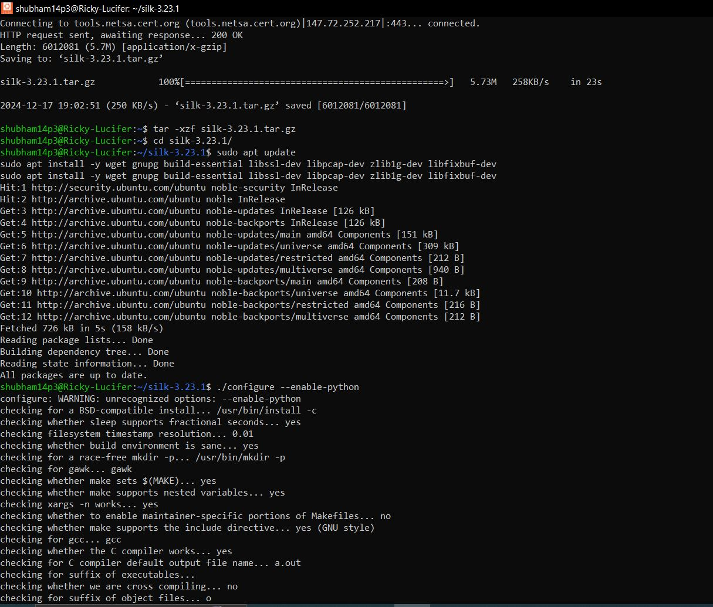
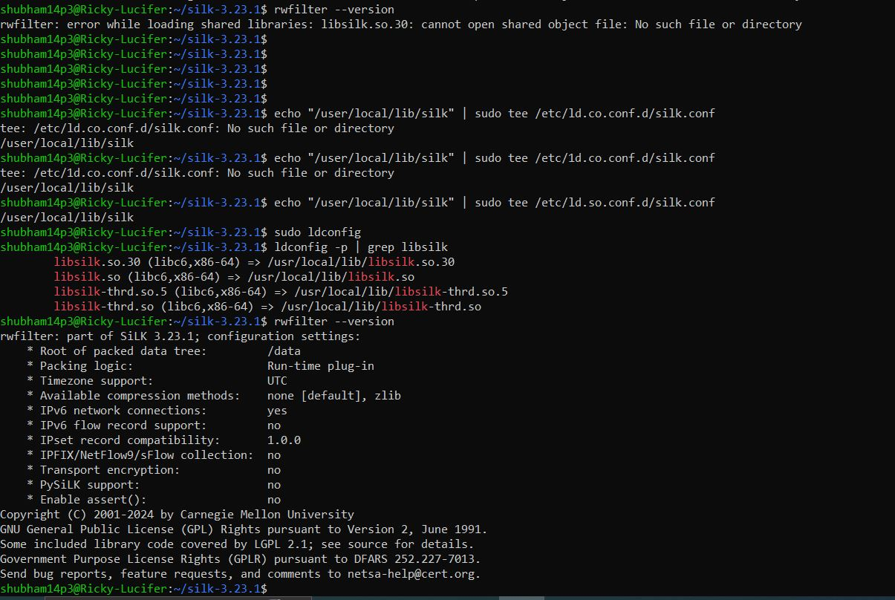
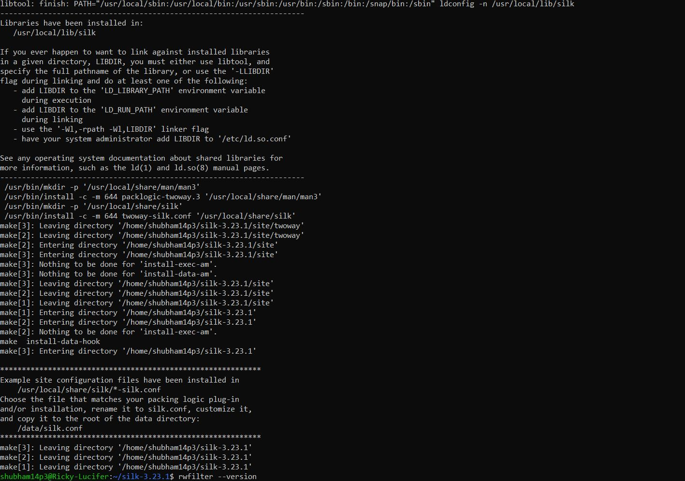
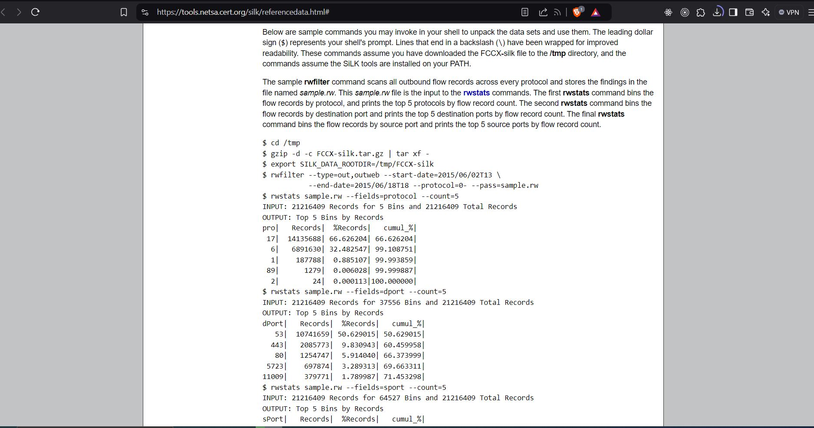
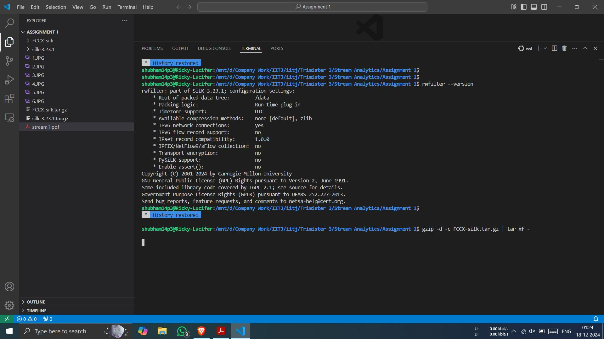
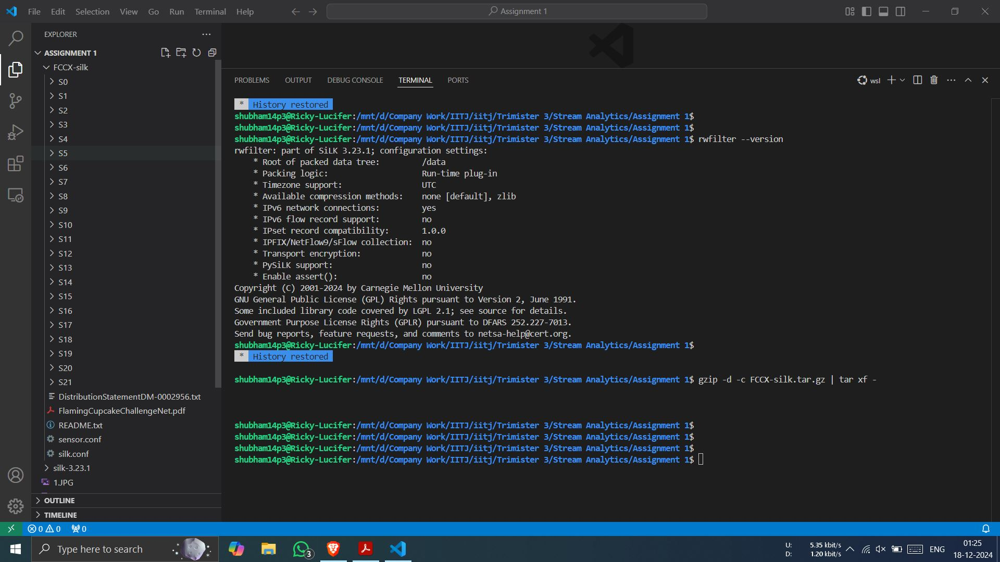
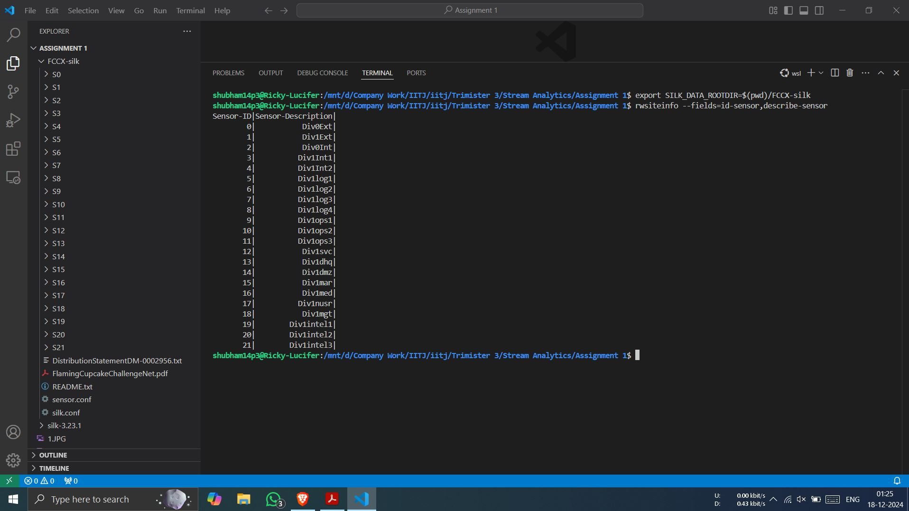
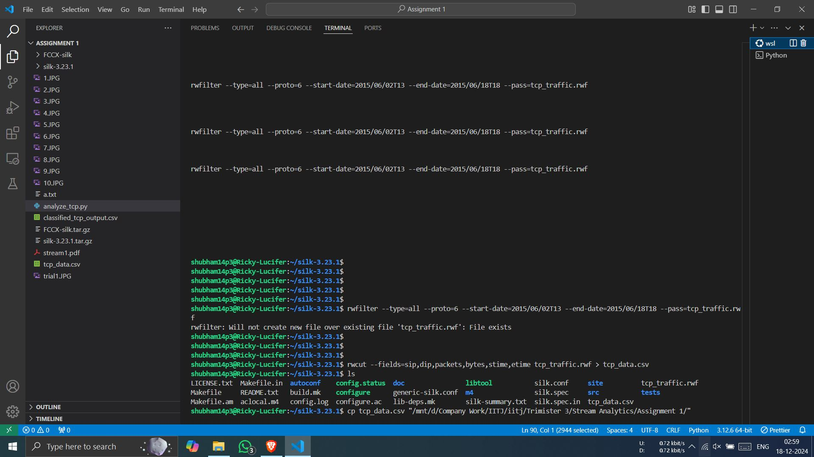
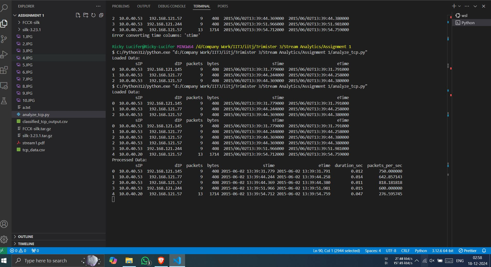
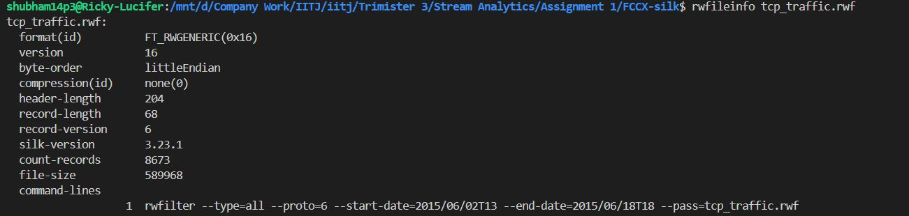

### Output
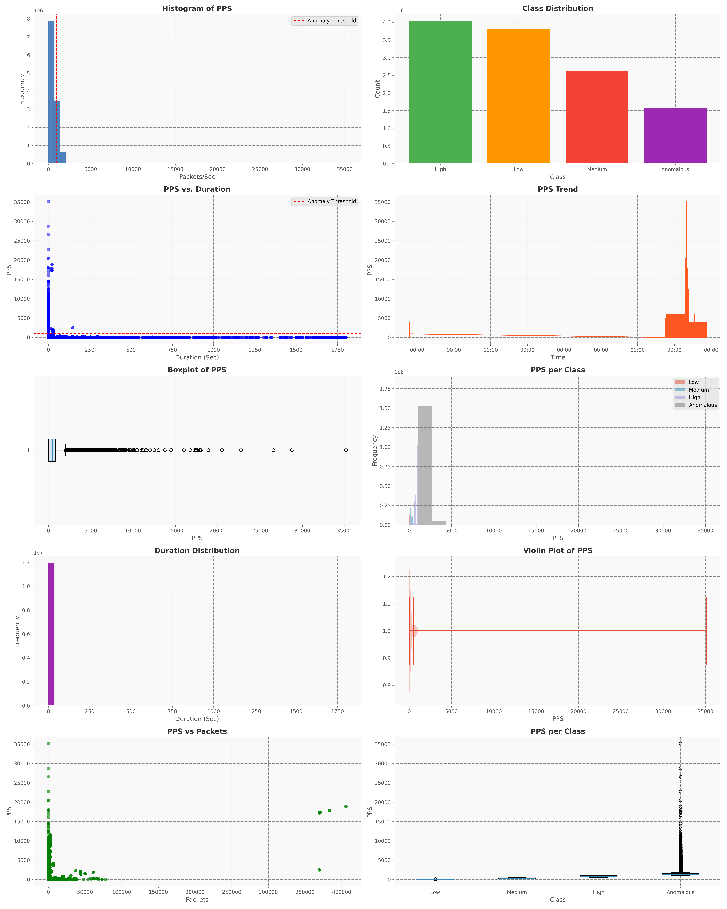
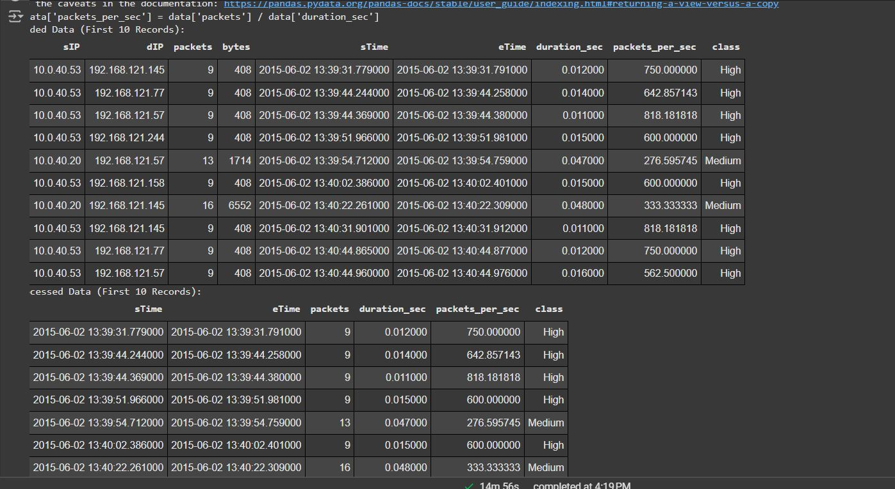
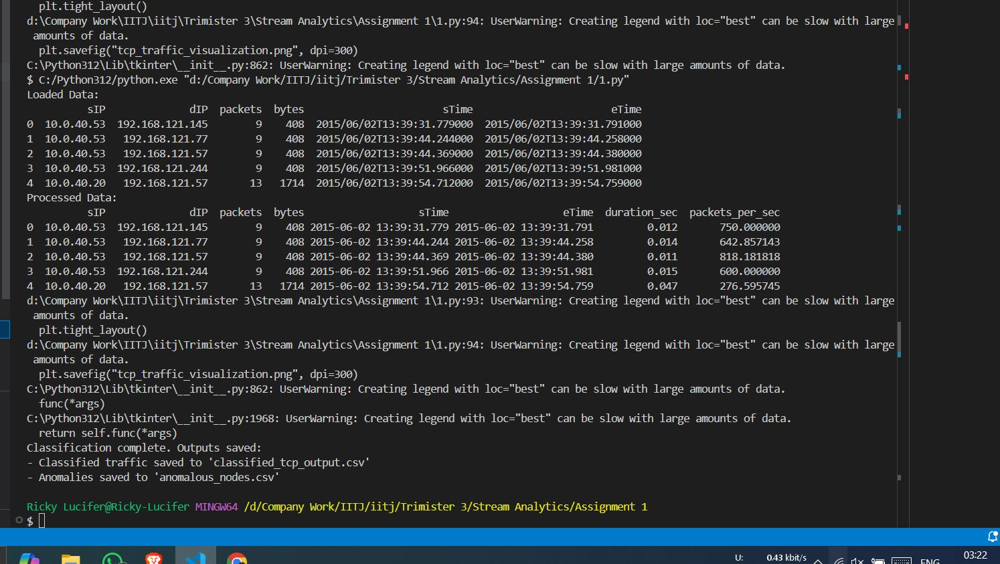
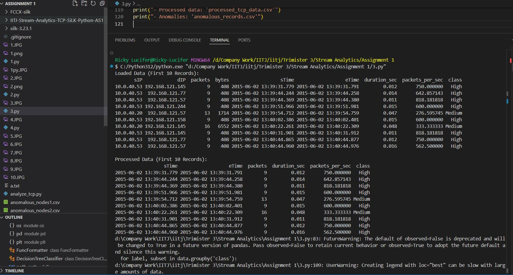

## **Methodology**

### **1. Understand the SiLK Suite**
- We need to familiariz ourself with the SiLK suite using its official documentations:
  [SiLK Reference Data](https://tools.netsa.cert.org/silk/referencedata.html#)
- Refering to the "SiLK Analysis Handbook" to understand basic retrieval commands:
  [SiLK Analysis Handbook (PDF)](https://tools.netsa.cert.org/silk/analysis-handbook.pdf)

### **2. Installation of SiLK Suite**
Follow these steps to install the SiLK Suite:

1. **Update Your System:**
   ```bash
   sudo apt update && sudo apt upgrade -y
   ```
2. **Install Required Dependencies:**
   ```bash
   sudo apt install -y wget gnupg build-essential libssl-dev libpcap-dev zlib1g-dev libfixbuf-dev
   ```
3. **Download the SiLK Suite Source:**
   ```bash
   wget https://tools.netsa.cert.org/releases/silk-3.23.1.tar.gz
   ```
4. **Extract the Downloaded File:**
   ```bash
   tar -xzf silk-3.23.1.tar.gz
   cd silk-3.23.1
   ```
5. **Configure, Build, and Install:**
   ```bash
   ./configure --enable-python
   make
   sudo make install
   ```
6. **Verify Installation:**
   ```bash
   rwfilter --version
   ```
   If successful, the version of SiLK will be displayed.

7. **Add Library Path (If Required):**
   If you encounter errors like missing libraries, add SiLK to the library path:
   ```bash
   echo "/usr/local/lib/silk" | sudo tee /etc/ld.so.conf.d/silk.conf
   sudo ldconfig
   ```

8. **Set Up Configuration File:**
   ```bash
   sudo mkdir -p /data
   sudo cp /usr/local/share/silk/generic-silk.conf /data/silk.conf
   ```

---

## **Data Processing Steps Using SiLK**

1. **Retrieve TCP Traffic:**
   Use the following command to filter TCP traffic and save it to a file:
   ```bash
   rwfilter --type=all --proto=6 \
    --start-date=2015/06/02T13 --end-date=2015/06/18T18 \
    --pass=tcp_traffic.rwf
   rwfilter --type=all --proto=6 --start-date=2015/06/02T13 --end-date=2015/06/18T18 --pass=tcp_traffic.rwf
   rwcut tcp_traffic.rwf --fields=sip,dip,packets,bytes,sTime,eTime > outputfile.txt

   ```
   - `--proto=6`: Filters TCP traffic.
   - `--type=all`: Fetches all records.
   - `--pass=stdout`: Outputs the results to the standard output.

---

## **Visualizations Using Python**

After retrieving and processing the data, use Python to analyze and visualize it:

1. **Load/Visualise/Exporting the Data:**

```python
import os
import pandas as pd
import matplotlib.pyplot as plt
from matplotlib.ticker import FuncFormatter
from sklearn.tree import DecisionTreeClassifier
# Adding to imports
from river import tree, preprocessing
from sklearn.cluster import KMeans
from sklearn.metrics import classification_report

# Step 1: Define file path for dataset
# Directory containing data file received from silk after convertinging it
path = "./assets/csv"  # Specify local directory to fetch the data
# Combining directory and file name to creating complete path
data_file = os.path.join(path, "tcp_data.csv")

# Step 2: Loading data into DataFrame
# Reading data from CSV file using pipe '|' as separator
# Strip extra spaces from column names for consistency
data = pd.read_csv(data_file, sep='|', skipinitialspace=True)
data.columns = data.columns.str.strip()

# Removing unwanted column if it exists
if 'Unnamed: 6' in data.columns:
    data = data.drop(columns=['Unnamed: 6'])

# Removing rows containing missing values
data = data.dropna()

# Converting start and end times to datetime format for calculations
data['sTime'] = pd.to_datetime(data['sTime'], errors='coerce')
data['eTime'] = pd.to_datetime(data['eTime'], errors='coerce')

# Compute session duration in seconds
data['duration_sec'] = (data['eTime'] - data['sTime']).dt.total_seconds()

# Filter rows where duration is greater than zero
data = data[data['duration_sec'] > 0]

# Calculate packets processed per second
data['packets_per_sec'] = data['packets'] / data['duration_sec']

# Removing rows with missing or invalid computed values and reset index
data = data.dropna().reset_index(drop=True)

# Categorize data into groups based on packets per second (PPS)
data['class'] = pd.cut(
    data['packets_per_sec'], bins=[0, 100, 500, 1000, float('inf')],
    labels=['Low', 'Medium', 'High', 'Anomalous']
)

# Step 3: Display raw and processed data
# Print first ten rows from raw dataset
print("Loaded Data (First 10 Records):")
print(data.head(10).to_string(index=False))

# Print first ten rows from processed dataset
print("\nProcessed Data (First 10 Records):")
print(data[['sTime', 'eTime', 'packets', 'duration_sec', 'packets_per_sec', 'class']].head(10).to_string(index=False))

# Step 4: Creating visualization function
def style_plot(ax, title, xlabel, ylabel):
    # Appling background color to plot
    ax.set_facecolor("#f9f9f9")
    # Adding gridlines for readability
    ax.grid(color='gray', linestyle='--', linewidth=0.5)
    # Set plot title and axis labels with proper styling
    ax.set_title(title, fontsize=14, weight='bold', color="#333333")
    ax.set_xlabel(xlabel, fontsize=12)
    ax.set_ylabel(ylabel, fontsize=12)

# Using modern plotting style for uniformity
plt.style.use('ggplot')

# Creating figure with multiple subplots for different graphs
fig, axes = plt.subplots(5, 2, figsize=(20, 25))

# Graph 1: Histogram showing PPS distribution
ax1 = axes[0, 0]
ax1.hist(data['packets_per_sec'], bins=50, color='#4F81BD', edgecolor='black')
ax1.axvline(1000, color='red', linestyle='--', label='Anomaly Threshold')
style_plot(ax1, "Histogram of PPS", "Packets/Sec", "Frequency")
ax1.legend()

# Graph 2: Bar chart showing distribution of classes
ax2 = axes[0, 1]
class_counts = data['class'].value_counts()
ax2.bar(class_counts.index, class_counts.values, color=['#4CAF50', '#FF9800', '#F44336', '#9C27B0'])
style_plot(ax2, "Class Distribution", "Class", "Count")

# Graph 3: Scatter plot visualizing PPS vs. Duration
ax3 = axes[1, 0]
ax3.scatter(data['duration_sec'], data['packets_per_sec'], c='blue', alpha=0.5)
ax3.axhline(1000, color='red', linestyle='--', label='Anomaly Threshold')
style_plot(ax3, "PPS vs. Duration", "Duration (Sec)", "PPS")
ax3.legend()

# Graph 4: Trend of PPS over time
ax4 = axes[1, 1]
data_sorted = data.sort_values(by='sTime')
ax4.plot(data_sorted['sTime'], data_sorted['packets_per_sec'], color='#FF5722', linewidth=1.5)
style_plot(ax4, "PPS Trend", "Time", "PPS")
ax4.xaxis.set_major_formatter(FuncFormatter(lambda x, _: pd.to_datetime(x).strftime('%H:%M')))

# Graph 5: Boxplot showing distribution of PPS
ax5 = axes[2, 0]
ax5.boxplot(data['packets_per_sec'], vert=False, patch_artist=True, boxprops=dict(facecolor="#D9E6F2"))
style_plot(ax5, "Boxplot of PPS", "PPS", "")

# Graph 6: Histogram showing PPS distribution for each class
ax6 = axes[2, 1]
for label, subset in data.groupby('class'):
    ax6.hist(subset['packets_per_sec'], bins=20, alpha=0.5, label=str(label))
style_plot(ax6, "PPS per Class", "PPS", "Frequency")
ax6.legend()

# Graph 7: Histogram showing session duration distribution
ax7 = axes[3, 0]
ax7.hist(data['duration_sec'], bins=50, color='#9C27B0', edgecolor='black')
style_plot(ax7, "Duration Distribution", "Duration (Sec)", "Frequency")

# Graph 8: Violin plot visualizing PPS distribution
ax8 = axes[3, 1]
ax8.violinplot(data['packets_per_sec'], vert=False, showmeans=True)
style_plot(ax8, "Violin Plot of PPS", "PPS", "")

# Graph 9: Scatter plot comparing PPS and Packets
ax9 = axes[4, 0]
ax9.scatter(data['packets'], data['packets_per_sec'], c='green', alpha=0.6)
style_plot(ax9, "PPS vs Packets", "Packets", "PPS")

# Graph 10: Boxplot comparing PPS across different classes
ax10 = axes[4, 1]
ax10.boxplot([data[data['class'] == cls]['packets_per_sec'] for cls in data['class'].cat.categories], patch_artist=True)
ax10.set_xticklabels(data['class'].cat.categories)
style_plot(ax10, "PPS per Class", "Class", "PPS")

# Adjust layout, save graphs as image, and display
plt.tight_layout()
plt.savefig("tcp_analytics_graphs.png", dpi=300)
plt.show()

# Step 5: Save processed data and anomalies to CSV files
# Write processed data to CSV
data.to_csv("./assets/csv/processed_tcp_data.csv", index=False)

# Extract rows classified as Anomalous and save separately
anomalies = data[data['class'] == 'Anomalous']
anomalies.to_csv("./assets/csv/anomalous_records.csv", index=False)

# Notify user about saved outputs
print("\nGraphs saved. Outputs available as:")
print("- Processed data: 'processed_tcp_data.csv'")
print("- Anomalies: 'anomalous_records.csv'")


# Step 6: Classification using VFDT
scaler = preprocessing.StandardScaler()
vfdt_model = tree.HoeffdingTreeClassifier()

# Train VFDT model
for _, row in data.iterrows():
    X = {'packets_per_sec': row['packets_per_sec']}
    y = row['class']
    vfdt_model = vfdt_model.learn_one(X, y)

# Step 7: Classification using On-Demand Clustering
kmeans = KMeans(n_clusters=3, random_state=0)
data['packets_cluster'] = kmeans.fit_predict(data[['packets_per_sec']])

# Map clusters to class labels
cluster_labels = {0: 'Low', 1: 'Medium', 2: 'High'}
data['cluster_class'] = data['packets_cluster'].map(cluster_labels)

# Step 8: Retrieve and query classified data
low_medium_nodes = data[data['class'].isin(['Low', 'Medium'])]
print("\nLow and Medium Nodes:")
print(low_medium_nodes)

# Step 9: Anomaly Detection
anomaly_threshold = 1000  # Adjust threshold based on observation
anomalies = data[data['packets_per_sec'] > anomaly_threshold]
print("\nAnomalous Nodes:")
print(anomalies)

# Save anomaly data for further analysis
anomalies.to_csv("./assets/csv/anomalies_nodes.csv", index=False)

# Step 10: Evaluate Classifier Accuracy
y_true = data['class']
y_pred_vfdt = [vfdt_model.predict_one({'packets_per_sec': x}) for x in data['packets_per_sec']]
print("\nVFDT Classification Report:")
print(classification_report(y_true, y_pred_vfdt))

y_pred_kmeans = data['cluster_class']
print("\nKMeans Classification Report:")
print(classification_report(y_true, y_pred_kmeans))

```

---

## **Expected Output**

1. **Terminal Output:**
   - Screenshot showing a summary of TCP packet analysis using the SiLK suite.

2. **Visualizations:**
   - Graphical representation of TCP traffic classification and anomaly detection.
   - Additional visualizations can be included if applicable.

---

## **How to Run the Code**

1. **Ensure Requirements Are Installed:**
   - Install required Python libraries:
     ```bash
     pip install pandas matplotlib river scikit-learn
     ```

2. **Run Script:**
   - Navigate to the directory containing `stream_analytics_as1.py` and execute:
     ```bash
     python stream_analytics_as1.py
     ```

3. **Expected Outputs:**
   - Graphs: Saved as `tcp_analytics_graphs.png`.
   - Processed data: Saved as `processed_tcp_data.csv`.
   - Anomalies: Saved as `anomalous_records.csv` and `anomalies_nodes.csv`.

---

## **Included Resources**

### **Data and Documentation:**
- SiLK Reference Data: [Link](https://tools.netsa.cert.org/silk/referencedata.html#)
- SiLK Analysis Handbook: [Link](https://tools.netsa.cert.org/silk/analysis-handbook.pdf)


## Authors

👤 **Shubham Raj**  
- GitHub: [@ShubhamRaj](https://github.com/shubham14p3)  
- LinkedIn: [Shubham Raj](https://www.linkedin.com/in/shubham14p3/)

---

## Contributions

Feel free to contribute by creating pull requests or submitting issues. Suggestions for improving data processing methods, adding more visualizations, or optimizing the application are welcome.

---

## Show Your Support

Give a ⭐ if you like this project!

---

## Acknowledgments

- Supported by [IIT Jodhpur](https://www.iitj.ac.in/).
- Data sourced from [Silk](https://tools.netsa.cert.org/).

---

<!-- MARKDOWN LINKS & IMAGES -->

[contributors-shield]: https://img.shields.io/github/contributors/shubham14p3/IITJ-Stream-Analytics-TCP-SiLK-Python-AS1.svg?style=flat-square
[contributors-url]: https://github.com/shubham14p3/IITJ-Stream-Analytics-TCP-SiLK-Python-AS1/graphs/contributors
[forks-shield]: https://img.shields.io/github/forks/shubham14p3/IITJ-Stream-Analytics-TCP-SiLK-Python-AS1.svg?style=flat-square
[forks-url]: https://github.com/shubham14p3/IITJ-Stream-Analytics-TCP-SiLK-Python-AS1/network/members
[stars-shield]: https://img.shields.io/github/stars/shubham14p3/IITJ-Stream-Analytics-TCP-SiLK-Python-AS1.svg?style=flat-square
[stars-url]: https://github.com/shubham14p3/IITJ-Stream-Analytics-TCP-SiLK-Python-AS1/stargazers
[issues-shield]: https://img.shields.io/github/issues/shubham14p3/IITJ-AIRBNB-DATA-CLEANING-PROCESSING-AND-ADVANCED-ANALYSIS-CAPSTONE-P

